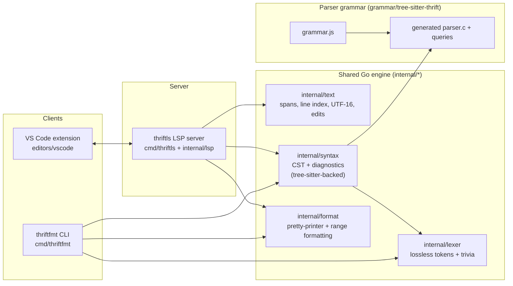
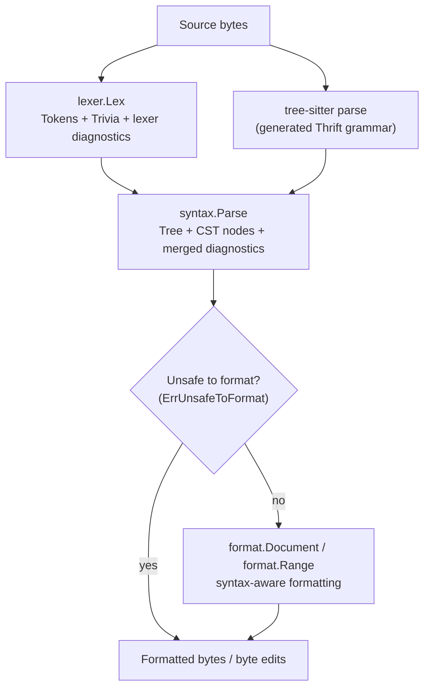
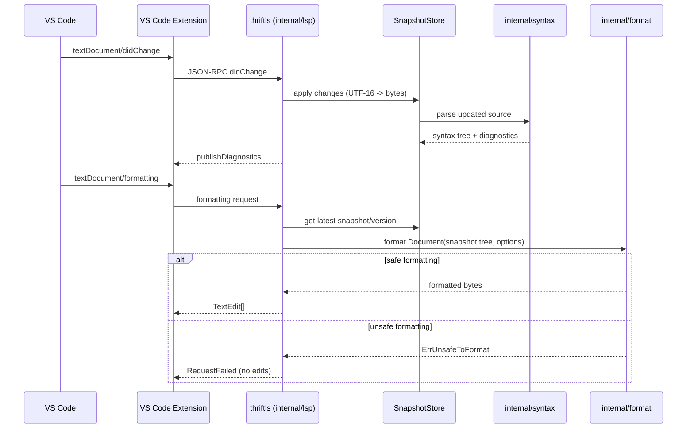

# Architecture Overview

This document summarizes the current `thrift-weaver` architecture and code ownership boundaries.

The RFC remains the source of truth for product and behavior decisions:

- `docs/rfcs/0001-thrift-tooling-platform.md`

Use this document to quickly answer:

- Where does lexer/parser/formatter/LSP code live?
- How do CLI and editor flows use the shared engine?
- Which components own syntax structure vs formatting fidelity?

## High-Level System

## Repository Ownership Map

Core implementation areas:

- `internal/text`
  - byte offsets/spans
  - UTF-16 <-> byte conversions for LSP
  - byte-edit validation/application
- `internal/lexer`
  - lossless lexing with trivia/comment preservation
  - lexer diagnostics
- `internal/syntax`
  - parse orchestration
  - CST-ish tree model and queries
  - parser/lexer alignment diagnostics
  - tree-sitter wrappers in `internal/syntax/treesitter`
- `internal/format`
  - formatting policies and errors (`ErrUnsafeToFormat`)
  - doc/printer primitives
  - syntax-aware Thrift formatting and range formatting
- `internal/lsp`
  - stdio JSON-RPC transport
  - document snapshots/versioning
  - diagnostics/formatting/editor-query handlers
  - semantic tokens

User-facing binaries:

- `cmd/thriftfmt`
  - file/stdin formatting
  - `--check`, `--write`, `--range`, debug dumps
- `cmd/thriftls`
  - launches LSP server over stdio

Parser grammar and query capture definitions:

- `grammar/tree-sitter-thrift/grammar.js`
- `grammar/tree-sitter-thrift/src/` (generated parser)
- `grammar/tree-sitter-thrift/queries/*.scm` (highlights, folds, symbols)

Editor integration:

- `editors/vscode`
  - TextMate grammar + language config
  - LSP client integration
  - extension packaging/bundling

Support code:

- `internal/testutil` (goldens/oracle helpers)
- `scripts/` (release metadata, perf tooling)
- `testdata/` (formatter goldens, LSP scenarios)

## Parse + Format Pipeline (Core Data Flow)

`thrift-weaver` intentionally separates:

- lexical fidelity (`internal/lexer`) for comments/trivia/raw token spans
- syntax structure (`tree-sitter` via `internal/syntax`) for robust CST queries

The formatter combines both.

Notes:

- `internal/syntax` aligns tree-sitter nodes to lexer tokens and emits internal alignment diagnostics when they disagree.
- `internal/format` fails closed for unsafe cases and preserves comments via lexer trivia.
- Range formatting widens to a safe ancestor before generating edits.

## LSP Request Flow (Formatting Example)

## Key Design Invariants

- `internal/*` packages are implementation packages (no stable public library API commitment in v1).
- Formatter safety is explicit:
  - unsafe cases return `ErrUnsafeToFormat`
  - CLI and LSP map that to user-facing errors without rewriting source
- LSP positions are converted at the boundary:
  - LSP uses UTF-16
  - engine internals use byte offsets/spans
- Comment fidelity is lexer-owned:
  - comments/trivia are preserved in lexer output
  - formatter emits comments from trivia rather than reconstructing them from syntax nodes

## Where To Add New Work

- New syntax parsing/query behavior: `internal/syntax` (and possibly `grammar/tree-sitter-thrift`)
- New formatting rules or style behavior: `internal/format`
- New editor features (LSP methods): `internal/lsp`
- VS Code UX/settings/client behavior: `editors/vscode`
- Corpus/golden/oracle tests: `testdata/*` + `internal/testutil`
