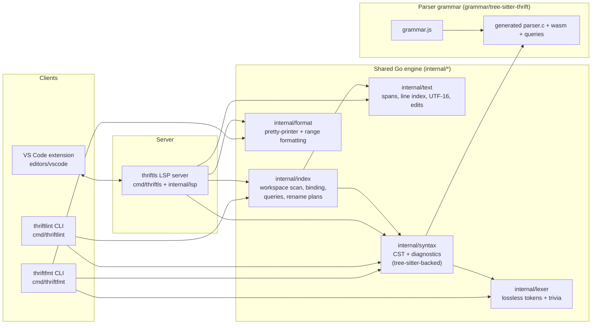
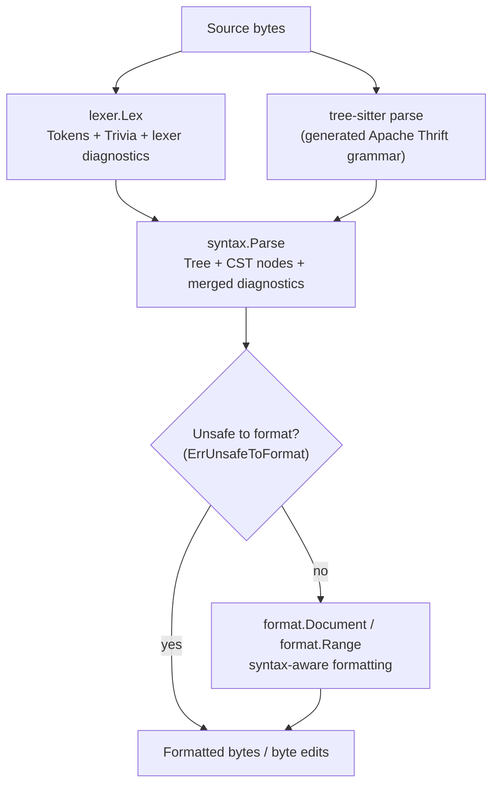
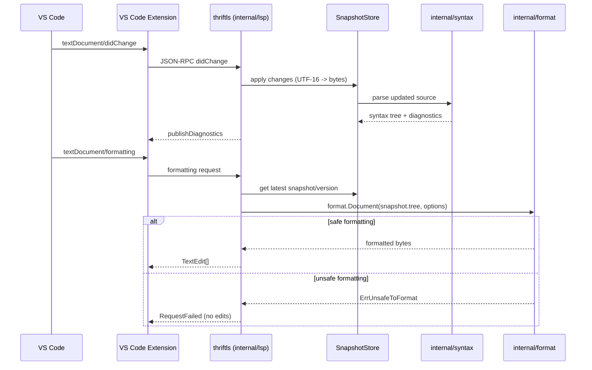

# Architecture Overview

This document summarizes the current architecture and code ownership boundaries for the **Weaver for Apache Thift**.

The RFC remains the source of truth for product and behavior decisions:

- `docs/rfcs/0001-thrift-tooling-platform.md`

Use this document to quickly answer:

- Where does lexer/parser/formatter/LSP code live?
- How do CLI and editor flows use the shared engine?
- Which components own syntax structure vs formatting fidelity?

## High-Level System

```mermaid
flowchart LR
  subgraph Clients
    CLI["thriftfmt CLI<br/>cmd/thriftfmt"]
    LINTCLI["thriftlint CLI<br/>cmd/thriftlint"]
    VSC["VS Code extension<br/>editors/vscode"]
  end

  subgraph Server
    LSP["thriftls LSP server<br/>cmd/thriftls + internal/lsp"]
  end

  subgraph Engine["Shared Go engine (internal/*)"]
    TXT["internal/text<br/>spans, line index, UTF-16, edits"]
    LEX["internal/lexer<br/>lossless tokens + trivia"]
    SYN["internal/syntax<br/>CST + diagnostics<br/>(tree-sitter-backed)"]
    IDX["internal/index<br/>workspace scan, binding,<br/>queries, rename plans"]
    FMT["internal/format<br/>pretty-printer + range formatting"]
  end

  subgraph Grammar["Parser grammar (grammar/tree-sitter-thrift)"]
    TSJS["grammar.js"]
    TSC["generated parser.c + wasm + queries"]
  end

  CLI --> FMT
  CLI --> SYN
  CLI --> LEX
  LINTCLI --> IDX
  LINTCLI --> SYN
  LSP --> FMT
  LSP --> IDX
  LSP --> SYN
  LSP --> TXT
  VSC <--> LSP
  IDX --> SYN
  IDX --> TXT
  SYN --> LEX
  SYN --> TSC
  TSJS --> TSC
```

## Repository Ownership Map

Core implementation areas:

- `internal/text`
  - byte offsets/spans
  - UTF-16 <-> byte conversions for LSP
  - byte-edit validation/application
- `internal/lexer`
  - lossless lexing with trivia/comment preservation
  - lexer diagnostics
- `internal/syntax`
  - parse orchestration
  - CST-ish tree model and queries
  - parser/lexer alignment diagnostics
  - tree-sitter wrappers in `internal/syntax/treesitter`
  - embedded wasm runtime execution via `wazero`
- `internal/format`
  - formatting policies and errors (`ErrUnsafeToFormat`)
  - doc/printer primitives
  - syntax-aware Apache Thrift formatting and range formatting
- `internal/index`
  - workspace file discovery and canonical URI identity
  - immutable workspace snapshots over on-disk files plus open-document shadows
  - include graph resolution, cross-file bindings, diagnostics, and navigation/rename queries
- `internal/lsp`
  - stdio JSON-RPC transport
  - document snapshots/versioning
  - diagnostics/formatting/editor-query handlers
  - workspace snapshot coordination for cross-file lint, definition, references, workspace symbols, and rename
  - semantic tokens

User-facing binaries:

- `cmd/thriftfmt`
  - file/stdin formatting
  - `--check`, `--write`, `--range`, debug dumps
- `cmd/thriftlint`
  - single-file and cross-file lint execution
  - `--cross-file`, `--workspace-root`, and `--include-dir`
- `cmd/thriftls`
  - launches LSP server over stdio

Parser grammar and query capture definitions:

- `grammar/tree-sitter-thrift/grammar.js`
- `grammar/tree-sitter-thrift/src/` (generated parser)
- `internal/grammars/thrift/` (embedded wasm artifact + checksum)
- `grammar/tree-sitter-thrift/queries/*.scm` (highlights, folds, symbols)

Editor integration:

- `editors/vscode`
  - TextMate grammar + language config
  - LSP client integration
  - extension packaging/bundling

Support code:

- `internal/testutil` (goldens/oracle helpers)
- `scripts/` (release metadata, perf tooling)
- `testdata/` (formatter goldens, LSP scenarios, workspace-index fixtures)

## Parse + Format Pipeline (Core Data Flow)

Weaver for Apache Thrift intentionally separates:

- lexical fidelity (`internal/lexer`) for comments/trivia/raw token spans
- syntax structure (`tree-sitter` via `internal/syntax`) for robust CST queries

The formatter combines both.

```mermaid
flowchart TD
  SRC["Source bytes"]
  LEX["lexer.Lex<br/>Tokens + Trivia + lexer diagnostics"]
  TS["tree-sitter parse<br/>(generated Apache Thrift grammar)"]
  SYN["syntax.Parse<br/>Tree + CST nodes + merged diagnostics"]
  SAFE{"Unsafe to format?<br/>(ErrUnsafeToFormat)"}
  DOC["format.Document / format.Range<br/>syntax-aware formatting"]
  OUT["Formatted bytes / byte edits"]

  SRC --> LEX
  SRC --> TS
  LEX --> SYN
  TS --> SYN
  SYN --> SAFE
  SAFE -- yes --> OUT
  SAFE -- no --> DOC
  DOC --> OUT
```

Notes:

- `internal/syntax` aligns tree-sitter nodes to lexer tokens and emits internal alignment diagnostics when they disagree.
- the shipped parser runtime is the embedded wasm artifact executed in-process via `wazero`
- `internal/format` fails closed for unsafe cases and preserves comments via lexer trivia.
- Range formatting widens to a safe ancestor before generating edits.

## LSP Request Flow (Formatting Example)

```mermaid
sequenceDiagram
  participant VSCode as VS Code
  participant Ext as VS Code Extension
  participant LS as thriftls (internal/lsp)
  participant Store as SnapshotStore
  participant Syn as internal/syntax
  participant Fmt as internal/format

  VSCode->>Ext: textDocument/didChange
  Ext->>LS: JSON-RPC didChange
  LS->>Store: apply changes (UTF-16 -> bytes)
  Store->>Syn: parse updated source
  Syn-->>Store: syntax tree + diagnostics
  LS-->>Ext: publishDiagnostics

  VSCode->>Ext: textDocument/formatting
  Ext->>LS: formatting request
  LS->>Store: get latest snapshot/version
  LS->>Fmt: format.Document(snapshot.tree, options)
  alt safe formatting
    Fmt-->>LS: formatted bytes
    LS-->>Ext: TextEdit[]
  else unsafe formatting
    Fmt-->>LS: ErrUnsafeToFormat
    LS-->>Ext: RequestFailed (no edits)
  end
```

## Workspace Index Flow

Cross-file features share one workspace index instead of re-binding independently in the CLI and LSP:

- `SnapshotStore` owns the latest open-document bytes, parse tree, version, and per-document generation.
- `internal/index.Manager` owns immutable `WorkspaceSnapshot` values built from on-disk scans plus open-document shadows.
- `thriftls` captures the active document snapshot and matching workspace generation before serving definition, references, workspace symbol, prepare-rename, and rename requests.
- parser diagnostics, local lint diagnostics, and workspace-lint diagnostics are published as independent buckets so stale workspace work cannot clear newer parse results.
- workspace folder changes, watched file changes, and periodic rescans refresh the workspace index without exposing half-built state to readers.

## Key Design Invariants

- `internal/*` packages are implementation packages (no stable public library API commitment in v1).
- Formatter safety is explicit:
  - unsafe cases return `ErrUnsafeToFormat`
  - CLI and LSP map that to user-facing errors without rewriting source
- LSP positions are converted at the boundary:
  - LSP uses UTF-16
  - engine internals use byte offsets/spans
- Workspace identity is shared:
  - `SnapshotStore`, `internal/index`, and LSP handlers all use the same canonical URI and `DocumentKey` derivation
  - open unsaved documents shadow on-disk content for diagnostics, navigation, and rename
- Comment fidelity is lexer-owned:
  - comments/trivia are preserved in lexer output
  - formatter emits comments from trivia rather than reconstructing them from syntax nodes

## Where To Add New Work

- New syntax parsing/query behavior: `internal/syntax` (and possibly `grammar/tree-sitter-thrift`)
- New formatting rules or style behavior: `internal/format`
- New cross-file binding, workspace diagnostics, or navigation/refactor behavior: `internal/index`
- New editor features (LSP methods): `internal/lsp`
- VS Code UX/settings/client behavior: `editors/vscode`
- Corpus/golden/oracle tests: `testdata/*` + `internal/testutil`
